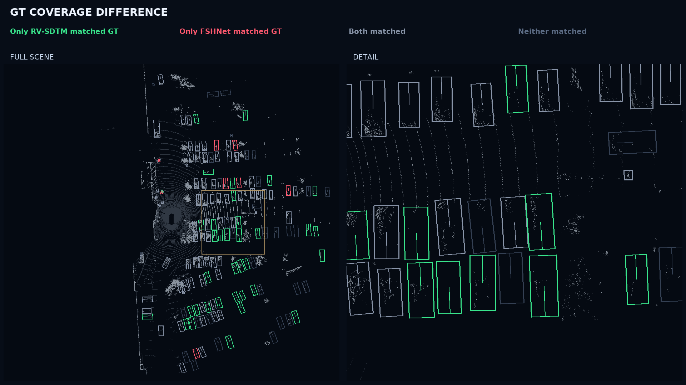
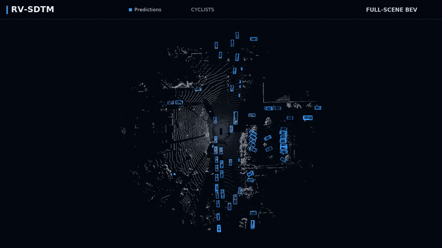
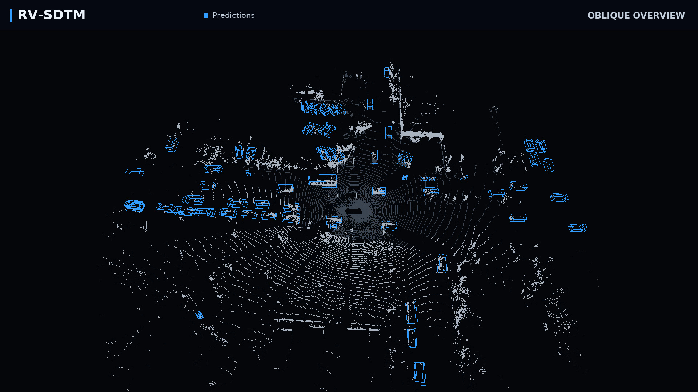
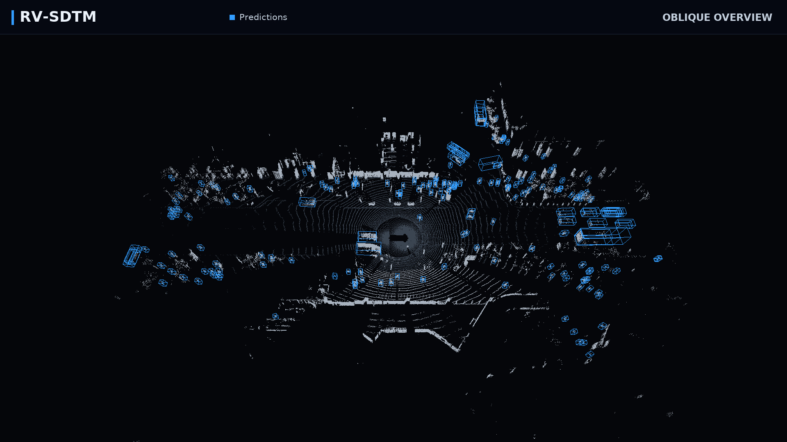
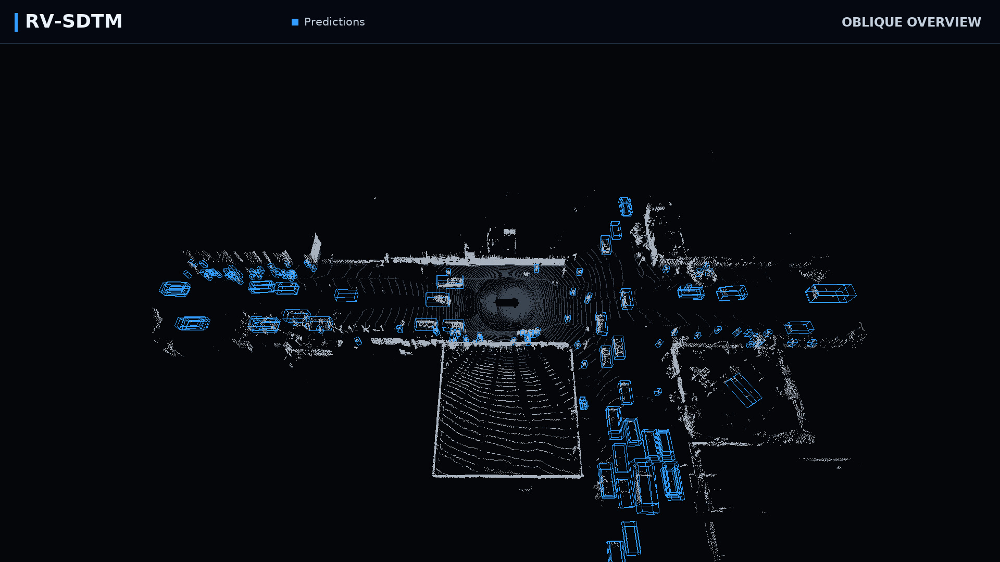
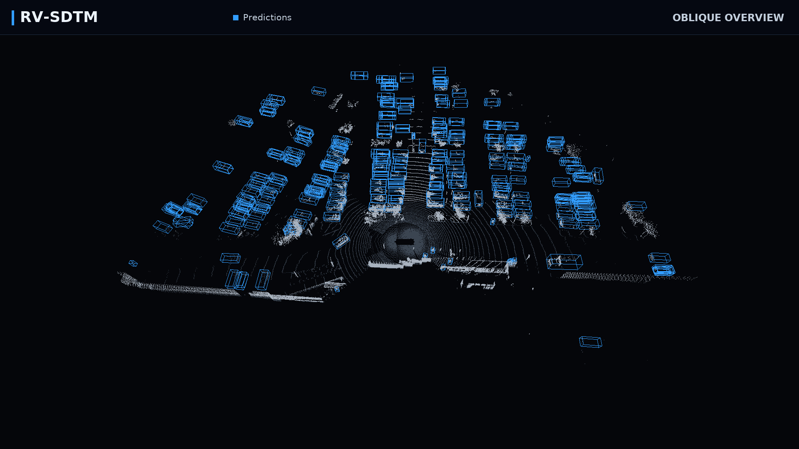

# Cross-View Semantic Injection and Sparse Dual-Path Token Mixer for 3-D Object Detection

*RV-SDTM · LiDAR object detection on Waymo, nuScenes, and Argoverse 2.*

Objects at long range or behind an occluder can leave only a few LiDAR returns.
RV-SDTM brings range-view context and voxel geometry together for LiDAR 3D
object detection, with a focus on these challenging scenes. Built on
[OpenPCDet](https://github.com/open-mmlab/OpenPCDet), this repository provides
the implementation, dataset-specific configurations, and reproducible workflows
for **Waymo Open Dataset, nuScenes, and Argoverse 2 (AV2)**.

[Qualitative examples](#qualitative-examples) ·
[Validation results](#measured-validation-performance) ·
[Install](#1-environment-setup) ·
[Prepare data](#2-dataset-preparation) ·
[Train](#3-reproduce-training) ·
[Evaluate](#4-official-evaluation) ·
[Documentation](#documentation)

### What is included

- **Three benchmarks:** data preparation, training, checkpoint resume, and
  official-evaluator integration for Waymo, nuScenes, and AV2.
- **Results with context:** archived checkpoint metrics, selected detection
  examples, and AV2 distance diagnostics extending to 200 m.
- **Reproduction guidance:** the validated A10 software stack, explicit
  multi-GPU commands, and dataset-free installation checks.

## Qualitative examples

Explore selected Waymo scenes, from vulnerable road users to dense traffic.
The gallery combines a GT-coverage diagnostic with RV-SDTM prediction videos;
their box colors have different meanings, as described below.

### GT coverage in dense traffic



**Green:** GT matched only by RV-SDTM. **Red:** GT matched only by the baseline.
Light/dark gray denote GT matched by both/neither model. These are **GT
rectangles, not predicted box coordinates**. The figure's “FSHNet” label refers
to **FSHNet-Light**. This is a selected diagnostic case; unmatched predictions
are not drawn, so the image does not establish a false-positive rate.

### Full-scene BEV · four scenes, one preview

[](docs/showcase/assets/full_bev.mp4)

[Open / download the 1080p BEV video](docs/showcase/assets/full_bev.mp4).
Blue boxes are RV-SDTM predictions. The 12-second sequence joins four distinct
scenes; playback frame rate is **not** inference speed.

### Multi-view detection gallery

Each cover links to a 13-second, 1080p video with oblique, low-angle,
frozen-frame orbit, and BEV views of the same source clip.

| Cyclists | Pedestrians |
|:---:|:---:|
| [](docs/showcase/assets/01_cyclists.mp4) | [](docs/showcase/assets/02_pedestrians.mp4) |
| **Distant pedestrians & cyclists** | **Dense traffic** |
| [](docs/showcase/assets/03_far_vru.mp4) | [](docs/showcase/assets/04_vehicles.mp4) |

[Gallery, figure notes & viewing options](docs/SHOWCASE.md) ·
[Long-range and occlusion figures](docs/SHOWCASE.md#earlier-qualitative-figures)

These author-supplied visualizations use a **different checkpoint** from the
archived Waymo metric row below. They are qualitative examples, not additional
benchmark measurements; identities and selection rules are in the gallery.

## Measured validation performance

| Dataset | Checkpoint and protocol | Result |
|---|---|---|
| Waymo | epoch 12, official validation | L1 mAP/mAPH **82.7917/80.5876**; L2 mAP/mAPH **76.8013/74.6541** |
| nuScenes | epoch 24, official validation, paired seed | NDS **71.0552**; mAP **67.4185** |
| AV2 | epoch 12, all 23,547 validation frames, 26 classes, 200 m ROI-only | AP/CDS **38.0/29.5**; mATE/mASE/mAOE **0.429/0.325/0.705** |

Each row reports an archived checkpoint evaluation. AP-style values are
percentages; the AV2 error terms retain their native units. The AV2 result uses
the explicit **200 m ROI-only** protocol, which differs from the default 150 m
leaderboard protocol. Checkpoint hashes and evaluation details are recorded in
[Results](docs/RESULTS.md). Checkpoint files are archived separately and are
not included in this source release.

### AV2 across distance

The same AV2 evaluation is also reported in four independently filtered
distance intervals. These diagnostics show how detection quality changes with
range. Their scores do **not** average to the overall result.

| Cuboid-center distance | mAP (%) | mCDS (%) |
|---|---:|---:|
| `[0, 50)` m | 52.5 | 42.2 |
| `[50, 100)` m | 25.5 | 19.0 |
| `[100, 150)` m | 10.7 | 7.4 |
| `[150, 200]` m | 3.6 | 2.4 |

## Documentation

| Guide | Contents |
|---|---|
| [Installation](docs/INSTALL.md) | Validated environment, dependencies, CUDA build, and installation checks |
| [Getting started](docs/GETTING_STARTED.md) | Dataset layouts, preprocessing, training, and evaluation |
| [Results](docs/RESULTS.md) | Measured metrics, evaluation protocols, and checkpoint identities |
| [Detection gallery](docs/SHOWCASE.md) | Waymo coverage figure, five videos, viewing options, and provenance |
| [Release guide](docs/RV_SDTM_RELEASE.md) | Configuration provenance and archived-checkpoint compatibility |

## Configurations

| Dataset | Configuration | Backbone | Detection head | Epochs |
|---|---|---|---|---:|
| Waymo | [cfgs/waymo_models/rv_sdtm.yaml](cfgs/waymo_models/rv_sdtm.yaml) | `RVSDTM` | `SparseDynamicHead` | 12 |
| nuScenes | [cfgs/nuscenes_models/rv_sdtm.yaml](cfgs/nuscenes_models/rv_sdtm.yaml) | `RVSDTMNuScenes` | `TransFusionHead` | 24 |
| AV2 | [cfgs/argoverse_models/rv_sdtm.yaml](cfgs/argoverse_models/rv_sdtm.yaml) | `RVSDTMAV2` | `SparseDynamicHead` | 12 |

Use the paths above for commands launched from the repository root. The
matching `tools/cfgs/` paths are used by distributed launchers executed inside
`tools/`. Always pass the configuration explicitly.

**RV-SDTM** is the method's short name, used in configuration filenames and
Python model identifiers throughout this repository.

## 1. Environment setup

Use the following software stack, validated on the local A10 server:

- Ubuntu 18.04 (Linux)
- Python 3.8.20
- PyTorch 1.10.0+cu113 and torchvision 0.11.0+cu113
- CUDA 11.3 toolkit (`nvcc` 11.3.58) and cuDNN 8.2
- spconv-cu113 2.3.6 and torch-scatter 2.1.2
- NVIDIA driver 470.82.01; four NVIDIA A10 24 GB GPUs were used locally

Clone the repository, create the environment, and compile the required CUDA
extensions:

```bash
git clone https://github.com/huhuhu301/Cross-View-Semantic-Injection-and-Sparse-Dual-Path-Token-Mixer-for-3-D-Object-Detection.git
cd Cross-View-Semantic-Injection-and-Sparse-Dual-Path-Token-Mixer-for-3-D-Object-Detection

conda create -n rv-sdtm python=3.8.20 -y
conda activate rv-sdtm

export CUDA_HOME=/usr/local/cuda-11.3
pip install torch==1.10.0+cu113 torchvision==0.11.0+cu113 \
    -f https://download.pytorch.org/whl/torch_stable.html
pip install -r requirements.txt
python setup.py develop
```

If several CUDA toolkits are installed, set `CUDA_HOME` to the CUDA 11.3
installation before building and confirm the selection with `nvcc --version`.
`torchaudio` is not required by RV-SDTM and is intentionally omitted.

`requirements.txt` installs dependencies for all three datasets. For a smaller
single-dataset environment, install `requirements-core.txt` followed by one of
`requirements-waymo.txt`, `requirements-nuscenes.txt`, or
`requirements-av2.txt` before running `python setup.py develop`.

Verify the installation without downloading a dataset:

```bash
python -m compileall pcdet tools
python tools/validate_rv_sdtm_release.py
python tools/validate_rv_sdtm_release.py --build
python tools/validate_rv_sdtm_release.py --argo2-forward
```

The last two commands require an NVIDIA GPU. This recommended stack is also the
recorded environment for the archived AV2 run and the release build/synthetic
checks. See [docs/INSTALL.md](docs/INSTALL.md) for the complete version record.

## 2. Dataset preparation

Download each dataset from its official provider and arrange the raw files as
follows:

```text
data/
├── waymo/
│   ├── raw_data/*.tfrecord
│   └── ImageSets/{train,val}.txt
├── nuscenes/
│   └── v1.0-trainval/
│       ├── v1.0-trainval/
│       ├── samples/
│       ├── sweeps/
│       └── maps/
└── argo2/
    └── sensor/
        ├── train/
        └── val/
```

Run all preparation commands from the repository root.

### Waymo Open Dataset

Create `data/waymo/ImageSets/train.txt` and `val.txt` with one TFRecord stem
per line, matching the files under `raw_data/`. Keep `--data_path` and
`--save_path` identical so the generated database paths remain valid.

```bash
python -m pcdet.datasets.waymo.waymo_dataset \
    --func create_waymo_infos \
    --cfg_file cfgs/dataset_configs/waymo_dataset.yaml \
    --data_path data/waymo \
    --save_path data/waymo \
    --processed_data_tag waymo_processed_data_v0_5_0 \
    --workers 16
```

### nuScenes

```bash
python -m pcdet.datasets.nuscenes.nuscenes_dataset \
    --func create_all \
    --cfg_file cfgs/nuscenes_models/rv_sdtm.yaml \
    --data_path data/nuscenes \
    --save_path data/nuscenes \
    --version v1.0-trainval \
    --max_sweeps 10
```

### Argoverse 2

```bash
python -m pcdet.datasets.argo2.argo2_dataset \
    --func create_all \
    --root_path data/argo2 \
    --cfg_file cfgs/argoverse_models/rv_sdtm.yaml
```

The generated info files and ground-truth databases remain under each dataset
root. For expected artifacts and troubleshooting, see
[docs/GETTING_STARTED.md](docs/GETTING_STARTED.md).

These commands assume the repository-local `data/` layout. For data stored
elsewhere, either create a symbolic link or place
`--set DATA_CONFIG.DATA_PATH /absolute/path/to/dataset` at the very end of the
training/evaluation command. If a command already has `--set`, append the data
path key/value to that same final list. `--root_dir` does not redirect a
dataset.

## 3. Reproduce training

The commands below are fixed-seed single-node reference launches.
`--batch_size` is the **global** batch size, `--fix_random_seed` uses seed
`666 + global rank`, and omitting `--use_amp` selects FP32. Training output is
written to `output/<dataset_group>/rv_sdtm/<extra_tag>/`. Always use a unique
`--extra_tag` for a new experiment because the trainer automatically resumes
the latest checkpoint found under an existing tag. `--workers` is the number
of data-loader workers per process.

### Waymo: 4 GPUs, global batch 8, 12 epochs

```bash
(cd tools && bash scripts/dist_train.sh 4 \
    --cfg_file cfgs/waymo_models/rv_sdtm.yaml \
    --batch_size 8 \
    --epochs 12 \
    --workers 2 \
    --sync_bn \
    --fix_random_seed \
    --skip_post_eval \
    --extra_tag waymo_e12_seed666)
```

### nuScenes: 8 GPUs, global batch 16, 24 epochs

```bash
(cd tools && bash scripts/dist_train.sh 8 \
    --cfg_file cfgs/nuscenes_models/rv_sdtm.yaml \
    --batch_size 16 \
    --epochs 24 \
    --workers 1 \
    --sync_bn \
    --fix_random_seed \
    --skip_post_eval \
    --extra_tag nuscenes_e24_seed666)
```

### AV2: 8 GPUs, global batch 16, 12 epochs

```bash
(cd tools && bash scripts/dist_train.sh 8 \
    --cfg_file cfgs/argoverse_models/rv_sdtm.yaml \
    --batch_size 16 \
    --epochs 12 \
    --workers 1 \
    --fix_random_seed \
    --skip_post_eval \
    --extra_tag av2_e12_seed666 \
    --set MODEL.BACKBONE_3D.RV_VOX_CHUNK 512)
```

The Waymo command is the recommended fixed-seed public recipe; its archived
checkpoint was trained on four GPUs with global batch 8 but did not record a
fixed training RNG, so bitwise reconstruction is not claimed. The archived
nuScenes and AV2 jobs used two nodes with four A10 GPUs per node. Their commands
above preserve world size, global batch, and optimizer schedule on one
eight-GPU node, but a topology change can still alter the final weights.

### Resume or initialize a run

For checkpoints created by this release, append
`--ckpt /absolute/path/to/checkpoint_epoch_N.pth` to restore the model,
optimizer, learning-rate scheduler, epoch, and iteration. `--epochs` is the
final total epoch count, not the number of extra epochs.

Use `--pretrained_model /absolute/path/to/checkpoint.pth` for model-only
initialization. The archived Waymo and nuScenes checkpoints require this
option when starting training because their optimizer parameter groups differ
from the released implementation. The archived AV2 checkpoint supports full
resume. See [checkpoint compatibility](docs/RV_SDTM_RELEASE.md#4-historical-checkpoint-compatibility)
for details.

Keep `--skip_post_eval` in training commands and run the corresponding official
evaluation below as a separate job.

## 4. Official evaluation

The configured SDTM router retains a stochastic route during evaluation, so
official comparisons must keep `--fix_random_seed --eval_seed 666` and the
same GPU/data ordering.

### Waymo

```bash
(cd tools && bash scripts/dist_test.sh 4 \
    --cfg_file cfgs/waymo_models/rv_sdtm.yaml \
    --ckpt /absolute/path/to/checkpoint_epoch_12.pth \
    --batch_size 8 \
    --workers 2 \
    --fix_random_seed --eval_seed 666 \
    --eval_tag official_waymo_val \
    --root_dir .. \
    --output_dir ../output/waymo_rv_sdtm_eval \
    --waymo_metrics_binary /absolute/path/to/compute_detection_metrics_main \
    --waymo_gt_bin /absolute/path/to/gt.bin)
```

The two native-metric arguments match the archived evaluation. Remove both to
use the official Python metric implementation instead.

### nuScenes

```bash
(cd tools && bash scripts/dist_test.sh 4 \
    --cfg_file cfgs/nuscenes_models/rv_sdtm.yaml \
    --ckpt /absolute/path/to/checkpoint_epoch_24.pth \
    --batch_size 8 \
    --workers 1 \
    --fix_random_seed --eval_seed 666 \
    --eval_tag official_nuscenes_val \
    --root_dir .. \
    --output_dir ../output/nuscenes_rv_sdtm_eval)
```

### Argoverse 2

```bash
(cd tools && bash scripts/dist_test.sh 4 \
    --cfg_file cfgs/argoverse_models/rv_sdtm.yaml \
    --ckpt /absolute/path/to/checkpoint_epoch_12.pth \
    --batch_size 8 \
    --workers 1 \
    --fix_random_seed --eval_seed 666 \
    --eval_tag official_av2_val \
    --root_dir .. \
    --output_dir ../output/av2_rv_sdtm_eval \
    --set MODEL.BACKBONE_3D.RV_VOX_CHUNK 512)
```

This AV2 command evaluates the configured 200 m ROI-only protocol. Do not
remove `DATA_CONFIG.EVALUATE_RANGE: 200.0` or
`DATA_CONFIG.EVAL_ONLY_ROI_INSTANCES: True` when comparing against the reported
result.

## Recording a reproduction

For each reported run, retain the YAML copied into the output directory, the
training/evaluation log, GPU count and model, global batch size, random seed,
software versions, checkpoint SHA-256, and the complete metric output. These
details make results traceable to a specific model and evaluation protocol.

`SOURCE_SHA256SUMS.txt` records the release source files (excluding itself).
Verify a downloaded source tree with `sha256sum -c SOURCE_SHA256SUMS.txt`.

## License

The source is released under [Apache License 2.0](LICENSE). Required upstream
attributions and component licenses are listed in [NOTICE](NOTICE) and
[THIRD_PARTY_NOTICES.md](THIRD_PARTY_NOTICES.md).
