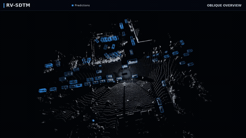
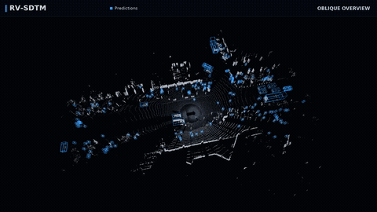
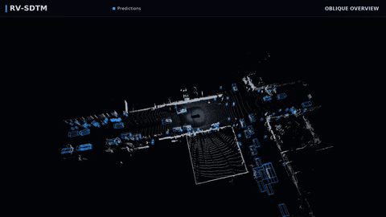
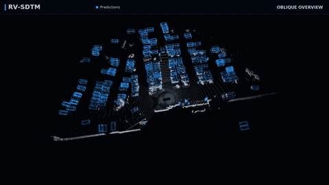
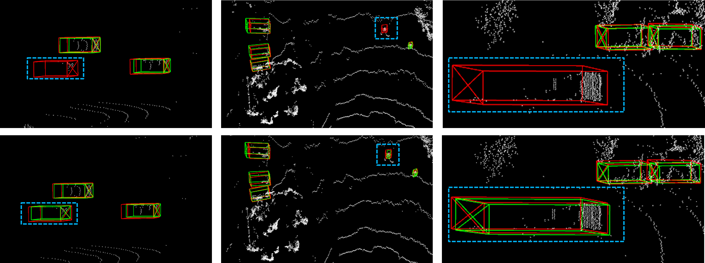
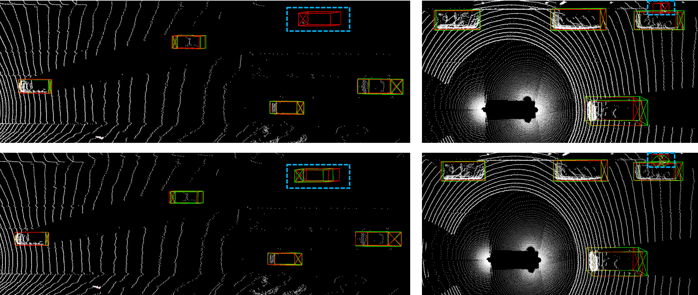

# RV-SDTM: detection gallery

Selected Waymo visualizations: one GT-coverage comparison, a full-scene BEV
sequence, and four class-focused multi-view prediction videos. Open the
images and videos directly to explore the detection examples.

[Coverage](#gt-coverage-in-dense-traffic) · [BEV](#full-scene-bev) ·
[Multi-view videos](#multi-view-videos) · [Viewing options](#viewing-options) ·
[Provenance](#provenance-and-diagnostic-protocol) · [Manuscript results](RESULTS.md)

## GT coverage in dense traffic


[Full-size image](showcase/assets/b_coverage.png)

The image uses **GT geometry colored by matching status**.

| Color | Meaning |
|---|---|
| Green | GT matched only by RV-SDTM |
| Red | GT matched only by FSHNet |
| Light gray | GT matched by both models |
| Dark gray | GT matched by neither model |
| Gold outline | Area enlarged in the right-hand panel |

All valid GT in the displayed area remain visible in this GT-only overlay.
The displayed frame was selected for the largest net GT-coverage gain among
30 candidate frames, with earlier frames breaking ties. Full diagnostic
counts, including unmatched predictions, are retained in the source CSV.

## Full-scene BEV

[](https://huhuhu301.github.io/Cross-View-Semantic-Injection-and-Sparse-Dual-Path-Token-Mixer-for-3-D-Object-Detection/#full_bev)

[Play 1080p video · 12 seconds](https://huhuhu301.github.io/Cross-View-Semantic-Injection-and-Sparse-Dual-Path-Token-Mixer-for-3-D-Object-Detection/#full_bev)

Blue boxes are actual RV-SDTM predictions at a display score threshold of 0.5.
The sequence concatenates four distinct Waymo scenes.
Each source clip contains 30 consecutive frames at 10 Hz; each frame is shown
three times in the 30 fps video export.

## Multi-view videos

The clips are organized by detection category to highlight **Cyclist,
Pedestrian, and Vehicle** results, with dedicated examples of distant road
users and dense traffic. Full-scene predictions provide context around the
featured object categories.

| Cyclists | Pedestrians |
|:---:|:---:|
| [](https://huhuhu301.github.io/Cross-View-Semantic-Injection-and-Sparse-Dual-Path-Token-Mixer-for-3-D-Object-Detection/#01_cyclists) | [](https://huhuhu301.github.io/Cross-View-Semantic-Injection-and-Sparse-Dual-Path-Token-Mixer-for-3-D-Object-Detection/#02_pedestrians) |
| [Play 1080p video · 13 s](https://huhuhu301.github.io/Cross-View-Semantic-Injection-and-Sparse-Dual-Path-Token-Mixer-for-3-D-Object-Detection/#01_cyclists) | [Play 1080p video · 13 s](https://huhuhu301.github.io/Cross-View-Semantic-Injection-and-Sparse-Dual-Path-Token-Mixer-for-3-D-Object-Detection/#02_pedestrians) |
| **Distant pedestrians & cyclists** | **Dense traffic** |
| [](https://huhuhu301.github.io/Cross-View-Semantic-Injection-and-Sparse-Dual-Path-Token-Mixer-for-3-D-Object-Detection/#03_far_vru) | [](https://huhuhu301.github.io/Cross-View-Semantic-Injection-and-Sparse-Dual-Path-Token-Mixer-for-3-D-Object-Detection/#04_vehicles) |
| [Play 1080p video · 13 s](https://huhuhu301.github.io/Cross-View-Semantic-Injection-and-Sparse-Dual-Path-Token-Mixer-for-3-D-Object-Detection/#03_far_vru) | [Play 1080p video · 13 s](https://huhuhu301.github.io/Cross-View-Semantic-Injection-and-Sparse-Dual-Path-Token-Mixer-for-3-D-Object-Detection/#04_vehicles) |

Each video replays one source clip from an elevated oblique view, a low-angle
view, a **FROZEN-FRAME ORBIT**, and BEV. The orbit moves the camera around a
frozen detection frame. These videos present the same four source scenes as
the BEV sequence, with predictions retained from the supplied model outputs.

## Viewing options

Animated GIF previews are visible directly in the GitHub README and this
guide. Click a preview to open the corresponding scene in the
[online gallery](https://huhuhu301.github.io/Cross-View-Semantic-Injection-and-Sparse-Dual-Path-Token-Mixer-for-3-D-Object-Detection/),
with video controls, fullscreen playback, and original 1080p MP4 downloads.

A self-contained, responsive HTML gallery with five video players is included
in [showcase/](showcase/README.md). After cloning, run from the repository root:

```bash
python3 -m http.server 8770 --bind 127.0.0.1 --directory docs/showcase
```

Open `http://127.0.0.1:8770/` on that machine. Alternatively, open the downloaded
`docs/showcase/index.html` in a browser. The same self-contained HTML gallery
is published through GitHub Pages.

## Provenance and diagnostic protocol

For the coverage diagnostic, both models use score threshold **0.5**, their
own training data configurations and native postprocessing, with aligned source
frames. Same-class, one-to-one 3D IoU matching uses thresholds **0.7 / 0.5 / 0.5**
for Vehicle / Pedestrian / Cyclist. GT must contain at least one LiDAR point.
The display region is the XY square **|x|, |y| ≤ 75 m**.
Coverage status reflects both same-class detection and the specified IoU
matching criterion.

The selected vehicle-scene frame is **0146**. It has 36 RV-SDTM-only matches,
8 baseline-only matches, 70 shared matches, and 32 GT matched by neither
model. The selected-frame net difference is +28. Unmatched prediction counts remain in the
[complete 30-frame diagnostic CSV](showcase/b_coverage_scores.csv).

The 12 original media files are retained byte-for-byte from the supplied package.
Four lightweight 480×270 GIF previews are derived from the original multi-view
MP4s, preserving each 13-second sequence. The original MP4s and posters are unchanged.
No architecture figures, raw point clouds, annotations, checkpoints,
or delivery archive are included. Dataset/media rights are not relicensed by
this repository; public distribution remains subject to the applicable permissions.

## Earlier qualitative figures

These earlier author-provided manuscript figures are retained separately.
**Upper row:** FSHNet comparison. **Lower row:** RV-SDTM. Here, unlike the
coverage figure above, green denotes **predictions**, red denotes **GT**, and
blue dashed outlines highlight selected objects. The new video package's
model identities are not assigned to these earlier figures.

### Long-range sparse returns



### Partial occlusion



See [Results](RESULTS.md) for the three-dataset summary.

[Back to the project](../README.md).
